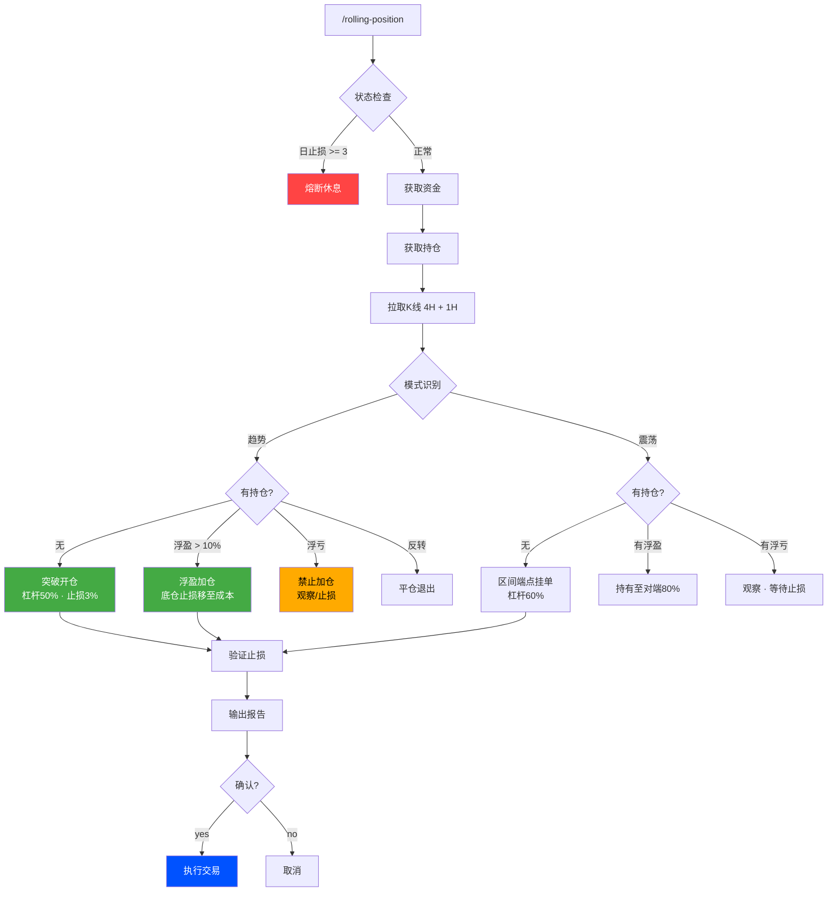
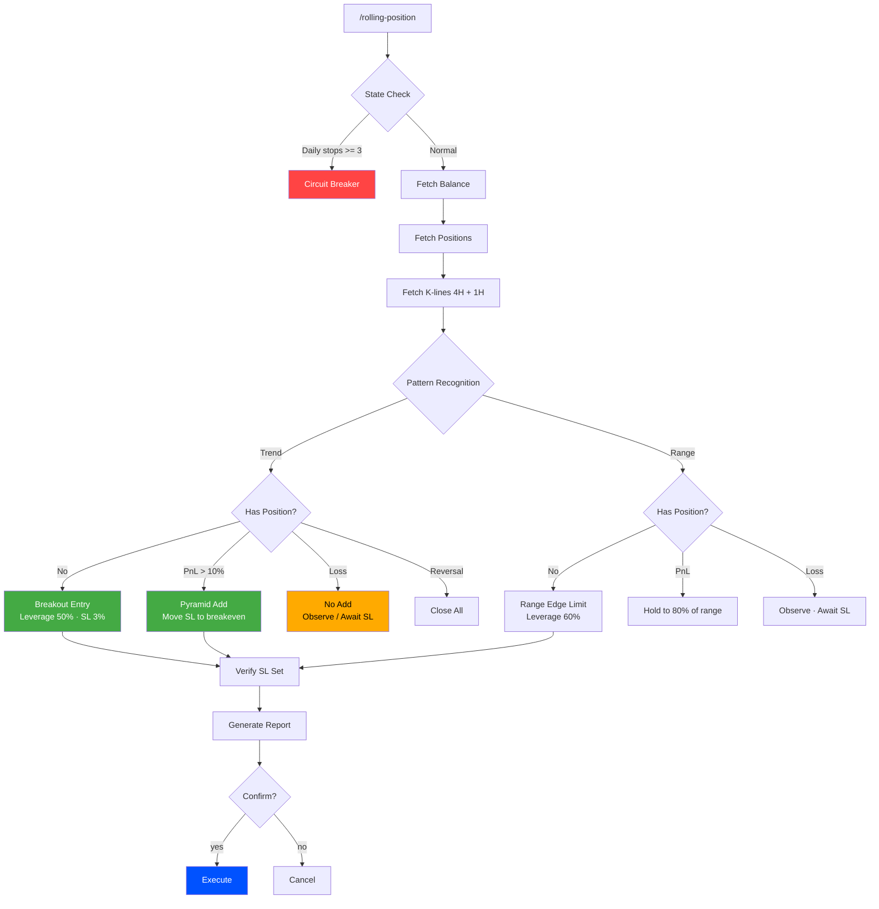

<p align="center">
  
  
  
  
</p>

<h1 align="center">MGBX 智能量化</h1>
<h3 align="center">MGBX Intelligent Quant · 金字塔认知交易智能体</h3>

<p align="center">
  <i>AI-powered position-rolling engine — distilling elite trader cognition into executable game-theoretic decisions</i>
</p>

---

<details open>
<summary><b>🇨🇳 中文</b></summary>

## 🧬 架构哲学

> *"浮盈加仓的本质不是放大杠杆，而是让利润在非对称风险结构中自我复制。"*

**MGBX 智能量化** 不是简单的策略脚本，而是一套**硅基交易认知体系**。它融合了两位顶级交易员的思维模型：

| 流派 | 核心思想 | 关键行为 |
|------|----------|----------|
| **比特皇** | 趋势突破后浮盈加仓，复利降杠杆 | 动态杠杆 + 止损熔断 |
| **予与** | 裸K识别震荡区间做波段 | 1:1 滚仓 + 龙头聚焦 |

两条认知流线合成了一条完整的 **感知 → 推理 → 执行 → 风控** 智能体管线。

---

## 🔄 交易逻辑流程



---

## ⚖️ 铁律

```
LAW 1  浮亏时绝对禁止加仓
LAW 2  单日止损 3 次 → 强制熔断
LAW 3  每一笔加仓必须绑定止损
LAW 4  止损优先级 >> 止盈
```

---

## ⚠️ MGBX 风控合规

策略行为与 [MGBX 异常交易风控规则](https://support.mgbx.com/hc/zh-cn/articles/10048306641167) 对齐：

| 规则 | 阈值 | 策略行为 |
|------|------|----------|
| 超短线交易 | 持仓 < 40s | ✅ 分钟/小时级持有 |
| API 频率 | ≤ 100次/秒 | ✅ 按需调用 |
| 撤单率 | < 70% | ✅ 市价单为主 |
| 刷单 / AB仓 | 禁止 | ✅ 单一账户单向策略 |
| 关联账户协同 | 禁止 | ✅ 不涉及多账户 |

---

## ⚡ 快速开始

```bash
git clone https://github.com/kime2026/rolling-position-mgbx.git
cd rolling-position-mgbx

mkdir -p ~/.mgbx/skills
cp mgbx_api.py ~/.mgbx/mgbx_api.py && chmod +x ~/.mgbx/mgbx_api.py

# 配置 ~/.mgbx/config.json 填入 MGBX API 密钥后：
python3 ~/.mgbx/mgbx_api.py balance
```

---

## 🎮 使用

```bash
/rolling-position btc_usdt
/rolling-position eth_usdt
/rolling-position          # 默认 btc_usdt
```

---

## 📡 API 映射

| 操作 | MGBX REST API |
|------|---------------|
| 资金 | `GET /fut/v1/balance/list` |
| 持仓 | `GET /fut/v1/position/list` |
| K线 | `GET /fut/v1/public/q/kline` |
| 下单 (含止损止盈) | `POST /fut/v1/order/create` |
| 一键平仓 | `POST /fut/v1/position/close-all` |
| 调整杠杆 | `POST /fut/v1/position/adjust-leverage` |
| 撤单 | `POST /fut/v1/order/cancel` |

> 完整文档：https://apidoc.mgbx.com

---

## 🔐 安全模型

```
 LobeChat (AI)     mgbx_api.py (本地签名)     MGBX API (执行)
      ✗                       ✓                       ✓
  AI 不接触密钥           HMAC-SHA256             交易所
```

---

## 👤 作者

<p align="center">
  
</p>

<h4 align="center">Kime</h4>
<h5 align="center">05后 金融认知架构师 · AI 交易智能体构建者</h5>

<p align="center">
他是数字原生的一代，也是金融 AI 原生的定义者。<br/>
当传统量化还在回测线性回归时，Kime 正在为下一个金融时代编写<strong>会思考的交易灵魂</strong>。<br/>
他专注于金融大模型的行为对齐，不单追求夏普比率，更致力于构建具备<strong>宏观嗅觉、反脆弱推理能力</strong>的认知交易智能体。<br/>
在 Kime 的架构中，AI 不再是执行指令的工具，而是在极度不确定的市场中，能进行<strong>多步博弈推演</strong>的硅基合伙人。
</p>

<p align="center">
  <code>AI Agent 交易系统设计</code>
  <code>金融 NLP 与情绪因子挖掘</code>
  <code>投资决策智能体对齐</code>
  <code>非线性交易架构</code>
</p>

</details>

---

<details>
<summary><b>🇬🇧 English</b></summary>

## 🧬 Philosophy

> *"The essence of pyramiding is not amplifying leverage — it's letting profits self-replicate within an asymmetric risk structure."*

**MGBX Intelligent Quant** is not a simple strategy script. It's a **silicon-based trading cognition system** distilling two elite traders' mental models:

| School | Core Idea | Signature |
|--------|-----------|-----------|
| **BitHuang** | Trend breakout pyramiding, compound deleveraging | Dynamic leverage + circuit breaker |
| **YuYu** | Naked-chart range swing trading | 1:1 rolling + leader-only |

Together they form a complete **Perceive → Reason → Execute → Control** cognitive pipeline.

---

## 🔄 Trading Flow



---

## ⚖️ Laws

```
LAW 1  Never add to a losing position
LAW 2  3 daily stops -> forced circuit breaker
LAW 3  Every add-on carries its own stop loss
LAW 4  Stop loss priority >> Take profit
```

---

## ⚠️ MGBX Risk Control Compliance

Aligned with [MGBX Abnormal Trading Rules](https://support.mgbx.com/hc/zh-cn/articles/10048306641167):

| Rule | Threshold | Strategy |
|------|-----------|----------|
| Ultra-short | < 40s hold | ✅ Minutes/hours scale |
| API rate | <= 100/sec | ✅ On-demand |
| Cancel rate | < 70% | ✅ Market orders |
| Wash / AB trading | Prohibited | ✅ Single account |
| Linked accounts | Prohibited | ✅ Not involved |

---

## ⚡ Quick Start

```bash
git clone https://github.com/kime2026/rolling-position-mgbx.git
cd rolling-position-mgbx

mkdir -p ~/.mgbx/skills
cp mgbx_api.py ~/.mgbx/mgbx_api.py && chmod +x ~/.mgbx/mgbx_api.py

# Configure ~/.mgbx/config.json with MGBX API keys:
python3 ~/.mgbx/mgbx_api.py balance
```

---

## 🎮 Usage

```bash
/rolling-position btc_usdt
/rolling-position eth_usdt
/rolling-position          # defaults to btc_usdt
```

---

## 📡 API Map

| Action | MGBX REST API |
|--------|---------------|
| Balance | `GET /fut/v1/balance/list` |
| Position | `GET /fut/v1/position/list` |
| K-line | `GET /fut/v1/public/q/kline` |
| Order (w/ SL/TP) | `POST /fut/v1/order/create` |
| Close All | `POST /fut/v1/position/close-all` |
| Leverage | `POST /fut/v1/position/adjust-leverage` |
| Cancel | `POST /fut/v1/order/cancel` |

> Docs: https://apidoc.mgbx.com

---

## 🔐 Security

```
 LobeChat (AI)     mgbx_api.py (local sign)     MGBX API (execute)
      ✗                       ✓                         ✓
  No key access          HMAC-SHA256               Exchange
```

---

## 👤 Author

<p align="center">
  
</p>

<h4 align="center">Kime</h4>
<h5 align="center">Post-05 Financial Cognitive Architect · AI Trading Agent Builder</h5>

<p align="center">
He is a digital native, and the definer of financial AI nativity.<br/>
While traditional quants are still backtesting linear regressions, Kime is writing <strong>trading souls that think</strong> for the next financial era.<br/>
He focuses on behavioral alignment of financial LLMs — not merely chasing Sharpe ratios, but building cognitive trading agents with <strong>macro perception and antifragile reasoning</strong>.<br/>
In Kime's architecture, AI is no longer a tool executing commands — it is a <strong>silicon-based partner</strong> capable of multi-step game-theoretic deduction in extremely uncertain markets.
</p>

<p align="center">
  <code>AI Agent Trading System Design</code>
  <code>Financial NLP & Sentiment Factor Mining</code>
  <code>Investment Decision Agent Alignment</code>
  <code>Nonlinear Trading Architecture</code>
</p>

</details>

---

## ⚠️ 免责 / Disclaimer

> 本 Skill 是基于规则的认知交易架构，**不构成投资建议**。加密货币合约交易存在极高风险。
>
> This Skill is a rules-based cognitive architecture. **NOT investment advice**. Crypto futures carry extreme risk.

---

<p align="center">
  <sub>Built with care by <a href="https://github.com/kime2026">Kime</a></sub>
</p>
