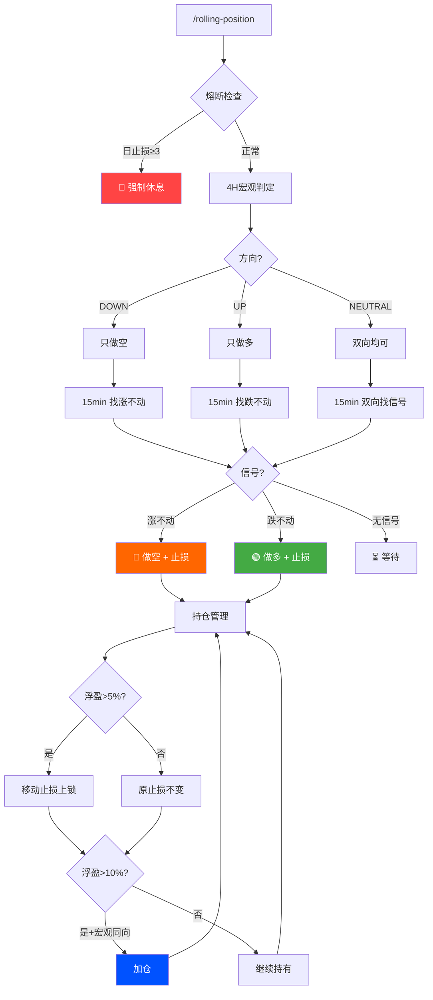

<p align="center">
  
  
  
  
</p>

<h1 align="center">🧠 MGBX 智能量化</h1>
<h3 align="center">双周期滚仓引擎 · 4H 定方向 + 15min 抓时机</h3>

<p align="center">
  <i>跌不动就多，涨不起来就空 —— 永远不逆大势开单</i>
</p>

---

## 🧬 架构哲学

> **4 小时管战略，15 分钟管战术。**

传统策略的问题是：用同一个时间轴同时判断方向和时机，导致震荡中反复止损、趋势中追涨杀跌。

**MGBX 智能量化** 把决策拆成两层：

| 层级 | 周期 | 职责 |
|------|------|------|
| **宏观层** | 4H | 判断大方向（UP/DOWN/NEUTRAL），决定只做多还是只做空 |
| **执行层** | 15min | 等待微观止跌/滞涨信号，寻找最优入场点 |

---

## 🔄 交易逻辑



---

## 📊 回测验证

> $20 本金 · 2026.5.25–6.05（BTC 暴跌 -17%）· 严格按照策略执行

| 指标 | 结果 |
|------|------|
| 最终资金 | **$213.43** |
| 总盈亏 | **+967.14%** |
| 交易次数 | 4 |
| 胜率 | **100%**（4胜0负） |
| 止损次数 | 0 |

| # | 日期 | 方向 | 入场 | 出场 | 盈亏 | 原因 |
|---|------|------|------|------|------|------|
| 1 | 5/25 | 🔴空 | 77,580 | 74,900 | +$0.27 | 止盈 |
| 2 | 5/27 | 🔴空 | 75,054 | 70,924 | +$0.41 | 移动止损 |
| 3 | 6/02 | 🔴空 | 67,998 | 63,392 | +$0.46 | 移动止损 |
| 4 | 6/04 | 🔴空 | 64,370 | 62,570 | +$0.18 | 回测结束 |

> 4H 从 5/25 起识别为 DOWN，15min 只找"涨不动"做空，4 笔全胜零止损。

---

## ⚖️ 铁律

```
LAW 1  不逆大势 — 4H下跌只做空，上涨只做多
LAW 2  三次熔断 — 单日止损3次 → 强制休息
LAW 3  止损必绑 — 每笔开仓同步设止损
LAW 4  移动锁利 — 浮盈>5%启动移动止损
```

---

## ⚠️ MGBX 风控合规

与 [MGBX 风控规则](https://support.mgbx.com/hc/zh-cn/articles/10048306641167) 对齐：

| 规则 | 阈值 | 策略 |
|------|------|------|
| 超短线 | < 40s | ✅ 15min 级别 |
| API 频率 | ≤ 100/s | ✅ 按需 |
| 撤单率 | < 70% | ✅ 市价为主 |

---

## ⚡ 快速开始

```bash
git clone https://github.com/kime2026/rolling-position-mgbx.git
cd rolling-position-mgbx
mkdir -p ~/.mgbx/skills
cp mgbx_api.py ~/.mgbx/mgbx_api.py && chmod +x ~/.mgbx/mgbx_api.py
# 配置 ~/.mgbx/config.json 填入 MGBX API 密钥
python3 ~/.mgbx/mgbx_api.py balance
```

---

## 🎮 使用

```bash
/rolling-position btc_usdt
/rolling-position          # 默认 btc_usdt
```

---

## 👤 作者

<p align="center">
  
</p>

<h4 align="center">Kime</h4>
<h5 align="center">05后 金融认知架构师 · AI 交易智能体构建者</h5>

<p align="center">
他是数字原生的一代，也是金融 AI 原生的定义者。<br/>
当传统量化还在回测线性回归时，Kime 正在为下一个金融时代编写<strong>会思考的交易灵魂</strong>。
</p>

<p align="center">
  <code>AI Agent 交易系统设计</code>
  <code>金融 NLP 与情绪因子挖掘</code>
  <code>投资决策智能体对齐</code>
  <code>非线性交易架构</code>
</p>

---

## ⚠️ 免责声明

不构成投资建议。加密货币合约交易存在极高风险。

---

<p align="center">
  <sub>Built with care by <a href="https://github.com/kime2026">Kime</a></sub>
</p>
