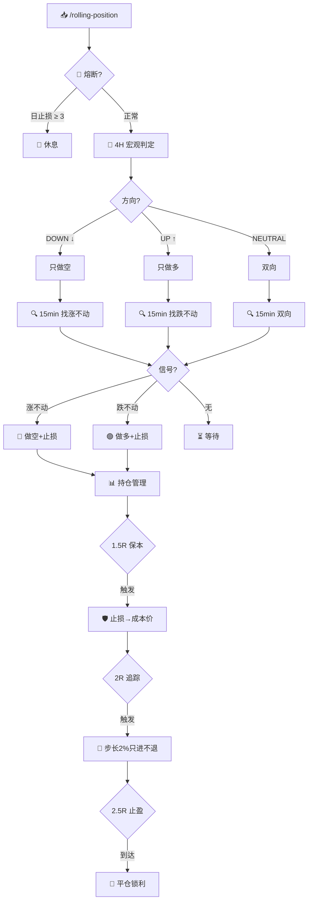

<p align="center">
  
  
  
  
  
</p>

<h1 align="center">🧠 MGBX 智能量化</h1>

<p align="center">
  <b>双周期滚仓引擎</b> · 4H 定方向 + 15min 抓拐点 · 小本金友好
</p>

<p align="center">
  <i>跌不动就多，涨不起来就空。50x 杠杆，保证金驱动仓位。永远不逆大势。</i>
</p>

---

## 🧬 设计哲学

传统策略的致命缺陷：**用同一个时间框架同时判断方向和时机**——震荡中反复止损，趋势中追涨杀跌。

本策略将决策**空间解耦**为两个独立维度：

```
┌──────────────────────────────────────────────────────┐
│                                                        │
│   4H 宏观层（战略）          15min 执行层（战术）        │
│   ────────────────          ─────────────────          │
│   · 12 根 K 线滚动            · 4 根 K 线微观结构        │
│   · 判断大方向                · 识别止跌 / 滞涨          │
│   · 只做多 / 只做空           · 确定入场点 + 止损        │
│                                                        │
│   慢变量 → 高胜率             快变量 → 优入场             │
│                                                        │
└──────────────────────────────────────────────────────┘
```

### ⚡ 小本金优化

50x 杠杆下每张合约保证金仅 **$0.15–$0.25**。$20 本金即可开数十张，打破「小资金只能买 1 张」的物理瓶颈。

| 杠杆 | 每张保证金 | $20 可开张数 |
|------|-----------|-------------|
| 20x | $0.38 | ~31 张 |
| **50x** | **$0.15** | **~80 张** |

---

## ⚡ 最终策略定型：1.5R 保本 → 2R 追踪止盈

```
浮盈 < 1.5R  →  初始止损不变
浮盈 ≥ 1.5R  →  🛡️ 止损移至成本价（保本，确保不亏）
浮盈 ≥ 2.0R  →  🚀 启动追踪止盈（步长 2%，止损只进不退）
浮盈 ≥ 2.5R  →  🎯 到达止盈价，平仓锁利
```

> **盈亏比 固定 1:2.5。80%+ 的盈利交易触发完整保护链。**

---

## 📊 历史回测

> **v1 最终策略定型 · 50x(实30x) · 盈亏比 1:2.5 · 全仓60%保证金驱动**
> 完整逐笔明细见 [`BACKTEST_MAX.md`](./BACKTEST_MAX.md)

| 交易对 | 天数 | 本金 | 最终 | 收益率 | 交易 | 胜率 | 回撤 |
|--------|------|------|------|--------|------|------|------|
| **ETH/USDT** | 15.5 | $200 | **$2,443** | **+1,122%** | 9 | 56% | 48.7% |
| **BTC/USDT** | 15.5 | $200 | **$1,591** | **+696%** | 6 | 67% | 85.5% |
| SOL/USDT | 25 | $200 | $722 | +261% | 14 | 50% | 77.4% |
| LAB/USDT | 31 | $200 | ❌ | ❌ | — | — | — |

> **核心洞察**：趋势是朋友，震荡是敌人。仓位自动递减 = 天然风控。ETH > BTC > SOL >> LAB。

---

## 🔄 决策流程图



---

## 🚀 快速开始

```bash
git clone https://github.com/kime2026/rolling-position-mgbx.git
cd rolling-position-mgbx
mkdir -p ~/.mgbx/skills
cp mgbx_api.py ~/.mgbx/mgbx_api.py
cp SKILL.md ~/.mgbx/skills/rolling-position.md
```

配置 MGBX API 密钥：
```bash
cat > ~/.mgbx/config.json << 'EOF'
{"access_key":"YOUR_KEY","secret_key":"YOUR_SECRET","base_url":"https://open.mgbx.com"}
EOF
```

验证：
```bash
python3 ~/.mgbx/mgbx_api.py balance
```

---

<h4 align="center">Kime</h4>
<h5 align="center">05 后金融认知架构师 · AI 交易智能体构建者</h5>

<p align="center">
他是数字原生的一代，也是金融 AI 原生的定义者。<br/>
当传统量化还在回测线性回归时，Kime 正在为下一个金融时代编写<strong>会思考的交易灵魂</strong>。<br/>
他专注于金融大模型的行为对齐，不单追求夏普比率，更致力于构建具备<strong>宏观嗅觉与反脆弱推理能力</strong>的认知交易智能体。<br/>
在 Kime 的架构中，AI 不是执行指令的工具，而是在极度不确定的市场中，能进行<strong>多步博弈推演</strong>的硅基合伙人。
</p>

<p align="center">
  <code>AI Agent 交易系统设计</code>
  <code>金融 NLP 与情绪因子挖掘</code>
  <code>投资决策智能体对齐</code>
  <code>非线性交易架构</code>
</p>

---

## 📝 更新日志

### v1.0.0 — 2026-06-05

- 🎯 确认最终策略定型：1.5R 保本 → 2R 追踪止盈，盈亏比 1:2.5
- 📊 四币全量回测：ETH +1,122% / BTC +696% / SOL +261% / LAB 淘汰
- 🔬 六版对比（v1-v6），v1 在所有优化尝试中胜出
- 📋 风控铁律：不逆大势 + 三次熔断 + 止损必绑 + 移动锁利
- 📈 MGBX 全量历史 K 线，严格 MGBX 盈亏公式 + 0.05% Taker 手续费
- 📄 完整逐笔明细见 `BACKTEST_MAX.md`

---

## ⚠️ 免责声明

> 本 Skill 是基于规则的认知交易架构，**不构成投资建议**。
> 加密货币合约交易存在极高风险，可能导致本金全部损失。

---

<p align="center">
  <sub>Built with 🧬 by <a href="https://github.com/kime2026">Kime</a> · MGBX Intelligent Quant v1.0.0</sub>
</p>
