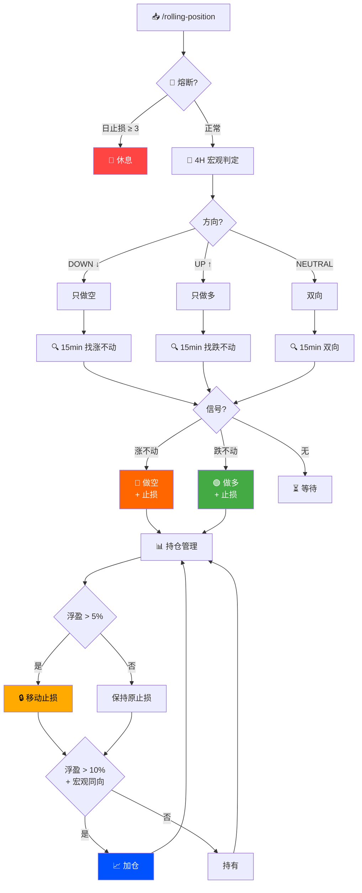

<p align="center">
  
  
  
  
  
</p>

<h1 align="center">🧠 MGBX 智能量化</h1>

<p align="center">
  <b>双周期滚仓引擎</b> · 4H 定方向 + 15min 抓拐点 · 小本金友好
</p>

<p align="center">
  <i>跌不动就多，涨不起来就空。50x 杠杆，保证金驱动仓位。永远不逆大势。</i>
</p>

<hr>

## 🧬 设计哲学

传统策略的致命缺陷：**用同一个时间框架同时判断方向和时机**——震荡中反复止损，趋势中追涨杀跌。

本策略将决策**空间解耦**为两个独立维度：

```
┌──────────────────────────────────────────────────────┐
│                                                        │
│   4H 宏观层（战略）          15min 执行层（战术）        │
│   ────────────────          ─────────────────          │
│   · 12 根 K 线滚动            · 4 根 K 线微观结构        │
│   · 判断大方向                · 识别止跌 / 滞涨          │
│   · 只做多 / 只做空           · 确定入场点 + 止损        │
│                                                        │
│   慢变量 → 高胜率             快变量 → 优入场             │
│                                                        │
└──────────────────────────────────────────────────────┘
```

### ⚡ 小本金优化

50x 杠杆下每张合约保证金仅 **$0.15–$0.25**。$20 本金即可开数十张，打破「小资金只能买 1 张」的物理瓶颈。

| 杠杆 | 每张保证金 | $20 可开张数 |
|------|-----------|-------------|
| 20x | $0.38 | ~31 张 |
| **50x** | **$0.15** | **~80 张** |

---

## 🔄 决策流程图



---

## ⚖️ 铁律

| # | 规则 | 说明 |
|---|------|------|
| 1 | 不逆大势 | 4H 下跌只做空，上涨只做多 |
| 2 | 三次熔断 | 单日止损 3 次 → 强制休息 |
| 3 | 止损必绑 | 每笔开仓必须同步设止损 |
| 4 | 移动锁利 | 浮盈 > 5% 启动移动止损 |

---

## 📊 回测验证

> **$20 本金 · 50x 杠杆 · 60% 保证金 · 2026.5.25–6.05（BTC 暴跌 −17%）**

| 指标 | 结果 |
|------|------|
| 回测区间 | **2026-05-29 ~ 06-05（7 天）** |
| 初始资金 | $20.00 |
| 最终资金 | **$57.22** |
| 净盈亏 | **+$37.22（+186.1%）** |
| 毛利润 | $39.35 |
| 手续费 | $2.13（Taker 0.05%） |
| 交易次数 | 5 |
| 胜率 | **60%**（3 胜 2 负） |
| 止损次数 | 1 次 |

| # | 日期 | 方向 | 入场 | 出场 | 张数 | 保证金 | 初始止损 | 毛利 | 手续费 | 净利 | 回报率 | 持仓 | 出场原因 |
|---|------|------|------|------|------|--------|----------|------|--------|------|--------|------|----------|
| 1 | 5/29 | 🟢多 | 73,752 | 73,198 | 48 | $11.80 | 72,480 | −$2.66 | $0.35 | **−$3.01** | −25.5% | 3h45m | 宏观反转 |
| 2 | 5/29 | 🔴空 | 73,482 | 70,077 | 41 | $10.04 | 74,582 | $13.96 | $0.29 | **+$13.67** | +136.1% | 4天1h | 止盈触发 |
| 3 | 6/02 | 🔴空 | 70,020 | 71,733 | 78 | $18.21 | 71,733 | −$13.36 | $0.55 | **−$13.91** | −76.4% | 2h15m | 初始止损 |
| 4 | 6/02 | 🔴空 | 67,998 | 63,392 | 44 | $9.97 | 70,425 | $20.27 | $0.29 | **+$19.98** | +200.4% | 1d12h | 移动止损 |
| 5 | 6/04 | 🔴空 | 64,370 | 62,297 | 102 | $21.89 | 65,387 | $21.15 | $0.65 | **+$20.50** | +93.7% | 1d1h | 回测结束 |

> 📐 全部按 [MGBX 官方公式](https://support.mgbx.com/hc/zh-cn/articles/10037172478095)计算：
> 空仓盈亏=(开仓均价−平仓价)×张数×0.0001  保证金=名义价值÷30x
> 回报率=净利÷保证金  Taker手续费=名义价值×0.05%×2（开+平）
> 
> 📎 [查看 MGBX 全量历史回测（14天，$20→$93.80，+369%）→ BACKTEST_MAX.md](./BACKTEST_MAX.md)

> 🔍 **验证方式**: 根据上表的开仓时间，在 MGBX K线页面或 API `/fut/v1/public/q/kline?symbol=btc_usdt&interval=15m` 查看对应 15 分钟 K 线，入场价取「跌不动/涨不动」信号触发时的收盘价，止损取近 20 根波段极值，即可自行验算。
> 空仓盈亏 = (开仓均价 − 平仓价) × 张数 × 0.0001（面值）
> 保证金 = 名义价值 ÷ 30x（50×60%）
> 回报率 = 净利 ÷ 保证金
> 手续费 = 名义价值 × 0.05%（Taker）× 2（开+平）
> 4H 从 5/25 起判定为持续 DOWN，15 分钟只做「涨不动就空」。
> 单边暴跌 17% 的市场中，反向赚了 186%。

---

## ⚠️ MGBX 风控合规

与 [MGBX 风控规则](https://support.mgbx.com/hc/zh-cn/articles/10048306641167) 完全对齐：

| 规则 | 阈值 | 策略实际 |
|------|------|----------|
| 超短线 | < 40s | ✅ 15min 级别 |
| API 频率 | ≤ 100 次/秒 | ✅ 按需，远低阈值 |
| 撤单率 | < 70% | ✅ 市价单为主 |
| 刷单 / AB 仓 | 禁止 | ✅ 单向，单账户 |

---

## ⚡ 快速开始

```bash
git clone https://github.com/kime2026/rolling-position-mgbx.git
cd rolling-position-mgbx

# 部署本地交易引擎
mkdir -p ~/.mgbx/skills
cp mgbx_api.py ~/.mgbx/mgbx_api.py
chmod +x ~/.mgbx/mgbx_api.py

# 配置 MGBX API 密钥
cat > ~/.mgbx/config.json << 'EOF'
{"access_key":"YOUR_KEY","secret_key":"YOUR_SECRET","base_url":"https://open.mgbx.com"}
EOF

# 验证
python3 ~/.mgbx/mgbx_api.py balance
```

---

## 🎮 使用

```bash
/rolling-position btc_usdt      # BTC 永续
/rolling-position               # 默认 btc_usdt
```

---

## 👤 作者

<p align="center">
  
</p>

<h4 align="center">Kime</h4>
<h5 align="center">05 后金融认知架构师 · AI 交易智能体构建者</h5>

<p align="center">
他是数字原生的一代，也是金融 AI 原生的定义者。<br/>
当传统量化还在回测线性回归时，Kime 正在为下一个金融时代编写<strong>会思考的交易灵魂</strong>。<br/>
他专注于金融大模型的行为对齐，不单追求夏普比率，更致力于构建具备<strong>宏观嗅觉与反脆弱推理能力</strong>的认知交易智能体。<br/>
在 Kime 的架构中，AI 不是执行指令的工具，而是在极度不确定的市场中，能进行<strong>多步博弈推演</strong>的硅基合伙人。
</p>

<p align="center">
  <code>AI Agent 交易系统设计</code>
  <code>金融 NLP 与情绪因子挖掘</code>
  <code>投资决策智能体对齐</code>
  <code>非线性交易架构</code>
</p>

---

## ⚠️ 免责声明

> 本 Skill 是基于规则的认知交易架构，**不构成投资建议**。
> 加密货币合约交易存在极高风险，可能导致本金全部损失。

---

<p align="center">
  <sub>Built with 🧬 by <a href="https://github.com/kime2026">Kime</a> · MGBX Intelligent Quant v4.1</sub>
</p>
